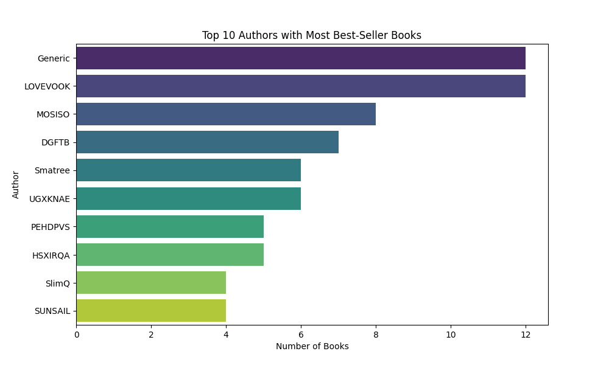
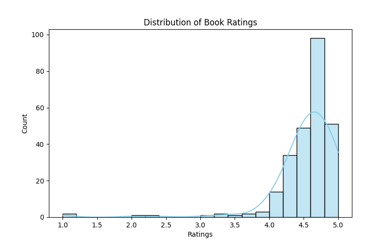
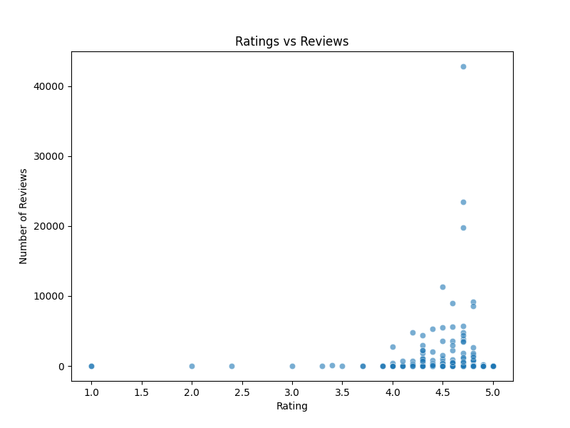

# 📚 Amazon Best Seller Books Analysis

This project analyzes **Amazon Best Seller Books** dataset using **Python, Pandas, and Seaborn**.  
It explores **patterns in ratings, reviews, prices, and authors** to understand book market trends.

---

## 🚀 Features
- Data cleaning and preprocessing with **Pandas**
- Exploratory Data Analysis (EDA)
- Visualizations:
  - Top 10 Authors with most best-seller books
  - Distribution of book ratings
  - Ratings vs Reviews relationship
- Actionable insights for **publishers, readers, and marketers**


---

## 📊 Sample Visuals

  
*Top 10 authors with most best-seller books.*

  
*Distribution of book ratings (most books rated above 4.5).*
 

*Shows realtion between how the reviews shows the impact on ratings too.(Social proof).*


---

## 🛠️ Tech Stack
- **Python**
- **Pandas**
- **Matplotlib**
- **Seaborn**

---

## ▶️ Run It Yourself
Clone this repo:
```bash
git clone https://github.com/princegit-09/Amazon-Best-Seller-Books.git
cd amazon-best-seller-books
pip install -r requirements.txt
python main.py

